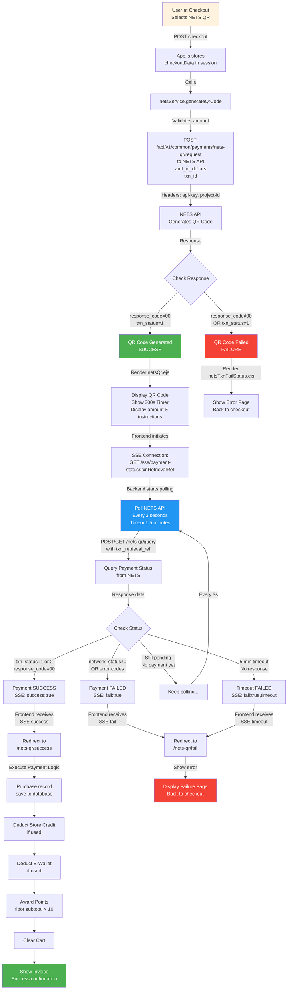

# Payment Flow Diagrams

## 1. PayPal Payment Flow

```mermaid
graph TD
    A["User at Checkout"] -->|Clicks PayPal Button| B["Frontend Loads PayPal SDK<br/>paypal.Buttons"]
    B -->|Click triggers| C["Frontend: POST /api/paypal/create-order<br/>amount + checkout data"]
    C -->|Backend receives| D["App.js: /api/paypal/create-order endpoint<br/>validates amount from session"]
    D -->|Calls| E["paypalService.createOrder amount<br/>gets access token via OAuth 2.0"]
    E -->|POST /v1/oauth2/token| F["PayPal API<br/>returns access_token"]
    F -->|Bearer token| G["POST /v2/checkout/orders<br/>intent: CAPTURE<br/>currency: SGD"]
    G -->|Response| H["PayPal returns<br/>order ID + approval links"]
    H -->|return orderID to frontend| I["PayPal Checkout Popup Opens<br/>User logs in & approves payment"]
    I -->|User approves| J["Frontend: POST /api/paypal/capture-order<br/>orderID"]
    J -->|Backend receives| K["App.js: /api/paypal/capture-order<br/>calls paypalService.captureOrder"]
    K -->|POST /v2/checkout/orders/:orderId/capture| L["PayPal API<br/>Captures funds"]
    L -->|Response status: COMPLETED| M["Transaction Successful<br/>capture.id = PayPal TX ID"]
    M -->|Begin post-payment| N["Purchase.record<br/>save to database"]
    N --> O["Deduct Store Credit<br/>if used"]
    O --> P["Deduct E-Wallet<br/>if used"]
    P --> Q["Award Loyalty Points<br/>floor subtotal × 10"]
    Q --> R["Mark Voucher Used<br/>if applied"]
    R --> S["CartItem.clear<br/>empty user cart"]
    S --> T["Delete session data<br/>checkoutData cleared"]
    T --> U["Return JSON<br/>success: true<br/>purchaseId<br/>transactionId"]
    U -->|Frontend redirect| V["GET /invoice/:purchaseId<br/>Show invoice"]
    V --> W["Display Invoice to User"]
    
    style A fill:#e1f5ff
    style M fill:#4caf50,color:#fff
    style W fill:#4caf50,color:#fff
```



---

## 2. NETS QR Payment Flow



---

## 3. E-Wallet Payment Flow (Complete Ecosystem)

```mermaid
graph TD
    subgraph TopUp["E-WALLET TOP-UP"]
        A["User: /ewallet/topup"] -->|Select payment method| B{Payment Method?}
        B -->|Credit/Debit Card<br/>Apple Pay| C["EWallet.createPendingTransaction<br/>status: pending"]
        B -->|PayPal| D["Redirect: /ewallet/topup/paypal<br/>PayPal SDK loads"]
        B -->|NETS QR| E["Redirect: /ewallet/topup/nets-qr<br/>Generate QR Code"]
        
        C -->|User confirms| C1["EWallet.addFunds<br/>ewallet_balance += amount"]
        D -->|PayPal payment success| D1["EWallet.addFunds<br/>ewallet_balance += amount"]
        E -->|NETS payment success| E1["EWallet.addFunds<br/>ewallet_balance += amount"]
        
        C1 --> F["INSERT ewallet_transactions<br/>type: top_up<br/>status: completed"]
        D1 --> F
        E1 --> F
        F --> G["Update Session User"]
        G --> H["Redirect: /ewallet<br/>Show success"]
    end
    
    subgraph Earning["LOYALTY POINTS EARNING"]
        I["Purchase Completed<br/>via any payment method"] -->|After order recorded| J["EWallet.addPoints<br/>points = floor subtotal × 10"]
        J --> K["UPDATE users<br/>points_balance += points"]
        K --> L["INSERT points_transactions<br/>type: earned"]
        L --> M{Check Auto-Convert}
        M -->|auto_convert_points=1<br/>AND points ≥ 100| N["convertPointsToCredit<br/>automatic"]
        M -->|auto_convert_points=0<br/>OR points < 100| O["Points stored<br/>for manual conversion later"]
        N --> N1["Largest multiple of 100:<br/>convertible = points - points%100"]
        N1 --> N2["UPDATE users<br/>points_balance -= convertible<br/>store_credit += convertible/100"]
        N2 --> N3["Record conversion<br/>in points_transactions"]
    end
    
    subgraph Spending["POINTS SPENDING AT CHECKOUT"]
        P["User at checkout<br/>ewallet_balance shown"] -->|Has points| Q["User enters<br/>pointsToSpend"]
        Q --> R{Validation}
        R -->|points ≥ amount<br/>AND multiples of 100| S["EWallet.spendPoints<br/>amount"]
        R -->|Invalid| R1["Show error<br/>try again"]
        S --> S1["UPDATE users<br/>points_balance -= pointsToSpend"]
        S1 --> S2["INSERT points_transactions<br/>type: spent"]
        S2 --> S3["Reduce payment amount:<br/>paymentAmount -= pointsToSpend × 0.01"]
    end
    
    subgraph Conversion["MANUAL POINT CONVERSION"]
        T["User: /ewallet<br/>View points_balance"] -->|Click convert| U["POST /ewallet/convert-points<br/>pointsAmount"]
        U --> V{Validate}
        V -->|divisible by 100<br/>AND sufficient points| W["EWallet.convertPointsToCredit<br/>points/100"]
        V -->|Invalid| V1["Show error<br/>must be multiples of 100"]
        W --> W1["UPDATE users<br/>points_balance -= points<br/>store_credit += points/100"]
        W1 --> W2["INSERT points_transactions<br/>type: redeemed"]
        W2 --> W3["Redirect: /ewallet<br/>Show success<br/>store_credit updated"]
    end
    
    subgraph Refund["REFUND AS STORE CREDIT"]
        X["User: /purchases<br/>Click request refund"] -->|Enter reason| Y["RefundController.requestRefund<br/>"]
        Y --> Y1["RefundRequest.create<br/>status: pending"]
        Y1 --> Y2["INSERT refund_requests<br/>reason stored"]
        Y2 --> Y3["Show: 'Awaiting admin review'"]
        Y3 -->|Admin reviews| Z["Admin: /admin/refunds<br/>View pending"]
        Z -->|Click approve| Z1["RefundController.approveRefund<br/>"]
        Z1 --> Z2["UPDATE refund_requests<br/>status: approved"]
        Z2 --> Z3["UPDATE users<br/>store_credit += refundAmount"]
        Z3 --> Z4["INSERT points_transactions<br/>type: refund"]
        Z4 --> Z5["User notified<br/>store_credit available"]
    end
    
    subgraph Payment["CHECKOUT WITH E-WALLET"]
        AA["User: /checkout<br/>Select E-Wallet"] -->|Available funds| AB["Show ewallet_balance<br/>& store_credit available"]
        AB -->|Select amounts to use| AC["User enters:<br/>ewalletToUse<br/>storeCreditToUse<br/>pointsToSpend"]
        AC --> AD["Calculate payment:<br/>total = subtotal + tax + shipping<br/>- voucherDiscount<br/>- storeCreditUsed<br/>- ewalletUsed"]
        AD -->|Payment = 0| AE["Order complete<br/>No external payment needed"]
        AD -->|Payment > 0| AF["Use other payment<br/>PayPal/NETS/Card"]
        AE --> AG["Purchase.record<br/>with all sources"]
        AF --> AG
        AG --> AH["Deduct E-Wallet:<br/>UPDATE users<br/>ewallet_balance -= ewalletUsed"]
        AH --> AI["Deduct Store Credit:<br/>UPDATE users<br/>store_credit -= storeCreditUsed"]
        AI --> AJ["Spend Points:<br/>UPDATE users<br/>points_balance -= pointsSpent"]
        AJ --> AK["Award new points:<br/>points += floor subtotal × 10"]
        AK --> AL["Show invoice"]
    end
    
    style TopUp fill:#e3f2fd
    style Earning fill:#f3e5f5
    style Spending fill:#e8f5e9
    style Conversion fill:#fff3e0
    style Refund fill:#fce4ec
    style Payment fill:#f1f8e9
```



---

## Quick Reference Table

| **Feature** | **PayPal** | **NETS QR** | **E-Wallet** |
|-------------|-----------|-----------|-------------|
| **Authentication** | OAuth 2.0 Bearer Token | API Key + Project ID | Session User ID |
| **Flow Type** | Synchronous (awaits capture) | Asynchronous (polls via SSE) | Direct DB Update |
| **Time to Complete** | 1-2 seconds | 3-300 seconds | Instant |
| **Polling Interval** | N/A | Every 3 seconds | N/A |
| **Max Timeout** | N/A | 5 minutes | N/A |
| **Refund Method** | Back to PayPal | Back to original payment | Store Credit |
| **Top-Up Sources** | Via PayPal SDK | Via NETS API | 4 methods (card/PayPal/NETS/Apple) |
| **Loyalty System** | No | No | Yes (Points + Auto-convert) |
| **Database Tables** | purchases + payment details | purchases + payment details | ewallet_transactions + points_transactions |
| **Points Earning** | No | No | ✓ $1 = 10 points |
| **Points Spending** | N/A | N/A | ✓ Reduces payment |
| **Points Conversion** | N/A | N/A | ✓ 100 pts = $1 store credit |
| **Auto-Convert Points** | N/A | N/A | ✓ When ≥100 points |

---

## Data Flow Summary

### PayPal
```
Frontend Button → Create Order → PayPal Popup → Capture → Record Purchase → Update Credits/Points → Clear Cart
```

### NETS QR
```
Generate QR → Show QR Page → User Scans & Pays → Poll Status (SSE) → Success/Fail/Timeout → Record Purchase/Fail Page
```

### E-Wallet
```
Top-Up: Select Method → Payment → Add to Balance
Earning: Purchase Complete → Award Points → Auto-Convert if ≥100
Spending: At Checkout → Select Points/Credit → Reduce Payment → Deduct Balance
Refund: Request → Admin Approves → Add to Store Credit
```
